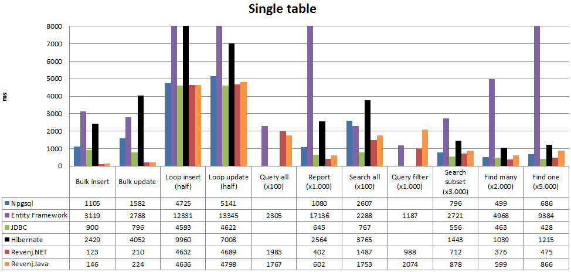
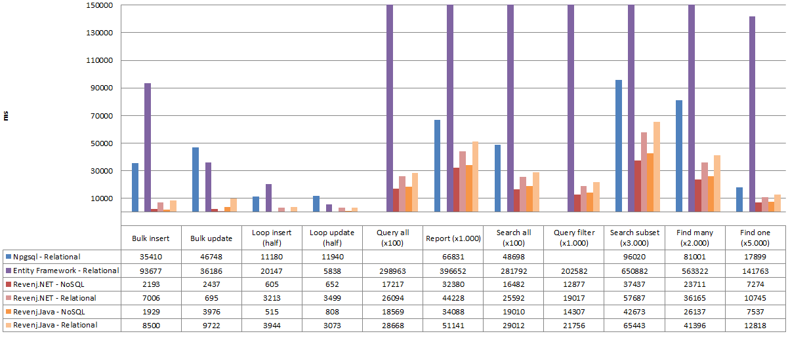

##Database access layer benchmark

This is reference benchmark for Revenj framework data layer.

Varieties of models are tested, from small simple objects, to very complex large objects.

Don't consider this a database benchmark, since there is no network roundtrip and only single client thread is used to talk with the database.

###Models

 * [simple](Benchmark/DSL/SimpleModel.dsl)
 * [standard](Benchmark/DSL/StandardModel.dsl)
 * [complex](Benchmark/DSL/ComplexModel.dsl)

###Testing assumptions

 * loading of whole aggregate
 * simple model is a single table data source
 * standard model represents a parent/child relationship. Implementation is free to choose a single table or two tables
 * complex model represents a parent/child/detail relationship. Implementation is free to choose a single table or three tables
 * multiple test types: 
	 * batch insert/update (single transaction)
	 * insert/update in a loop (multiple transactions)
	 * primary key lookups
	 * optimized search (known in advance)
	 * LINQ search (runtime conversion)
	 * report (loading of several data sources)

###Libraries

 * Npgsql (2.2.4.3) - used to implement manual SQL approach; talks to Postgres using binary protocol (never version exists, but it's mostly slower and require some code changes... will be added later)
 * Revenj (1.2.1) - implemented both as a "standard" relational approach with aggregation in a single object and as a "NoSQL" object oriented approach; Uses customized old Npgsql which talks to Postgres using text protocol
 * Entity Framework 6 - most popular .NET ORM.
 * Hibernate 5 - most popular Java ORM.
 * JDBC PostgreSQL (9.4-1202) - official JDBC driver for PostgreSQL
 * MsSql ADO.NET - not included in results, but you can run the bench to see how it stands
 * Oracle ODP.NET - not included in results, but you can run the bench to see how it stands

###Single table test

Small table which should reflect simple database interaction. Npgsql does not implement "true" batch inserts/updates, but rather reuses the same command.

Interestingly Postgres can return few columns using binary protocol up to 3x faster than a record using text protocol.

###Parent/child test

Standard pattern which is implemented as two tables in a relational database, but can be implemented as a single table in an object-relational database. Npgsql can't really be used for "NoSQL" approach since it would require a lot of complex code.

###Parent/child/child test

Sometimes complex nested tables are required. Due to multiple roundtrips, unoptimized bulk insert/update performs really poorly. Manual SQL code is starting to be really complex. 

###Reproducing results

Run [GatherResults.exe](app/GatherResults.exe) by pointing it to an [Postgres instance](app/DALBenchmark.exe.config)

Individual tests can be run as:

 * [DalBenchmark.exe](app/DALBenchmark.exe) (example: *DALBenchmark.exe Npgsql Simple 10000*)

If you are interested in changing the models, then you can:

 * install Visual studio plugin: [DDD for DSL](https://visualstudiogallery.msdn.microsoft.com/5b8a140c-5c84-40fc-a551-b255ba7676f4)
 * or use [dsl-clc](https://github.com/ngs-doo/dsl-compiler-client/releases)

###Results:

Full results are available in [Excel spreadsheet](results/results.xlsx).

Bench was run on Windows7 with Postgres 9.3 locally installed.

###Conclusions:

 * Manual coding of SQL and object materialization is often not the fastest way to talk to the database
 * Complex models will benefit from "NoSQL" approach to modeling
 * DSL Platform compiler will create a lot of boilerplate in the database, but it will also put that boilerplate to use
 * Postgres JDBC driver performance has improved significantly with version 1202
